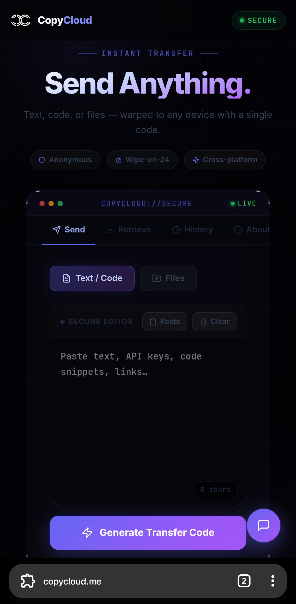
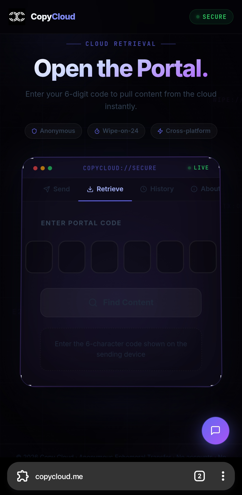
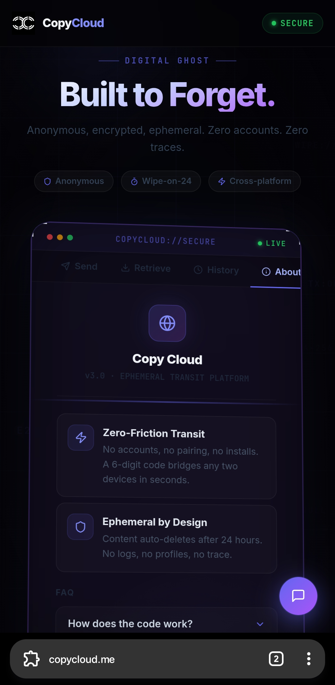

<div align="center">


# Copy Cloud

### Move text and files between your devices in seconds — no sign-up needed

[](https://copycloud.me/)

</div>

---

## What is Copy Cloud?

Ever needed to quickly send a photo from your phone to your laptop, or paste some text from one device to another — without emailing yourself or signing into anything?

**Copy Cloud** is a free website that lets you do exactly that.

- Open [copycloud.me](https://copycloud.me/) on **any device**
- Send text or a file and get a short **6-character code**
- Type that code on another device to instantly get your content

No account. No app to download. No login. Just open the website and go.

---

## 📸 Screenshots

<table>
  <tr>
    <td align="center"><b>Send tab — share text or a file</b></td>
    <td align="center"><b>Retrieve tab — enter the code</b></td>
    <td align="center"><b>About tab — learn more</b></td>
  </tr>
  <tr>
    <td></td>
    <td></td>
    <td></td>
  </tr>
</table>

---

## 🚀 How to Use Copy Cloud

### Step 1 — Send something

1. Go to **[copycloud.me](https://copycloud.me/)** on any device.
2. Click the **Send** tab at the top.
3. Choose what you want to share:
   - **Text** — paste or type anything (notes, links, passwords, etc.)
   - **File** — pick a photo, document, video, or any file up to **40 MB**
4. Click **"Generate Secure Code"**.

### Step 2 — Save your code

- You'll get a short **6-character code** (like `A3K9Z7`).
- Keep this code — it's your key to the content.
- A **QR code** is also shown — scan it with your other device's camera to skip typing.

### Step 3 — Retrieve on another device

1. Open **[copycloud.me](https://copycloud.me/)** on your other device.
2. Click the **Retrieve** tab.
3. Type in your 6-character code.
4. Your text or file appears instantly — copy it or download it.

> ⏰ **Important:** All content is automatically and permanently deleted after **24 hours**. Make sure to retrieve it in time.

---

## ✨ Features

### 🔐 No Account Needed
You don't need to sign up, log in, or give any personal information. Just open the website and start sharing.

### 📱 Works on Any Device
Use it on your phone, tablet, laptop, or desktop — any device with a web browser works. Mix and match freely.

### 📝 Share Text
Copy-paste anything — a note, a link, a long password, a code snippet, an address. There's no character limit.

### 🖼️ Share Files
Upload photos, documents, audio clips, videos, or any file type up to **40 MB** in size.

### 🔒 Auto-Delete After 24 Hours
Your content is never stored permanently. Everything is wiped after 24 hours, keeping your data private.

### 📷 QR Code
When you send something, a QR code appears automatically. Scan it with your phone's camera to retrieve the content on that device — no typing needed.

### 📜 Recent History
The website remembers your last 5 clips locally on your device (not stored online), so you can quickly revisit recent shares.

### 🎨 Customisable Look
Make the app look the way you like:
- **Light / Dark / Auto theme** — switch between bright and dark modes, or let it follow your device's setting automatically
- **12 accent colour presets** — Indigo, Purple, Blue, Emerald, Rose, Amber, Teal, Pink, Crimson, Cyan, Gold, Violet
- **11 background textures** — Dots, Grid, Waves, Diagonal, Diamonds, Circles, Crosshatch, Hexagons, Triangles, Stars, Zigzag
- **Texture density slider** — adjust how tight or loose any pattern looks in real time

Your chosen style is saved and remembered next time you visit.

### 📲 Install as an App
On a phone or tablet, you can add Copy Cloud to your home screen like a regular app — no App Store required. Just tap **"Add to Home Screen"** in your browser menu.

---

## 📊 Quick Reference

| What | Limit / Detail |
|---|---|
| Text length | No limit |
| File size | Up to 40 MB |
| Content lifespan | 24 hours, then deleted |
| Account required | None |
| Recent history | Last 5 clips (stored on your device only) |
| Supported devices | Any device with a modern web browser |

---

## ❓ Common Questions

**Q: Is it free?**
Yes, completely free to use.

**Q: Do I need to install anything?**
No. Just open [copycloud.me](https://copycloud.me/) in any web browser.

**Q: Is my content private?**
Yes. No one else knows your 6-character code unless you share it with them. All content is deleted automatically after 24 hours.

**Q: What if I lose my code?**
The app keeps a history of your last 5 codes on the device you used to send. If you've cleared your browser data or used a different device, the code cannot be recovered.

**Q: Can I share with someone else?**
Yes! Just give them the 6-character code (or let them scan the QR code) and they can retrieve it on any device.

**Q: What file types are supported?**
Any file type — images, PDFs, Word documents, spreadsheets, audio, video, zip files — as long as it's under 40 MB.

---

## 🔮 Coming Soon

- [ ] Password-protected clips — add a passphrase to lock your content
- [ ] Custom expiry times — choose how long your content stays (1 hour, 1 week, etc.)
- [ ] Browser extension — send content with one click from any webpage
- [ ] End-to-end encryption — extra security for sensitive content

---

## 🤝 Contributing

Found a bug or have an idea? Contributions are welcome!

1. **Fork** this repository
2. **Create** a branch: `git checkout -b feature/your-idea`
3. **Commit** your changes
4. **Open a Pull Request**

Please open an issue first for large changes so we can discuss them together.

---

## 👨‍💻 Developer

**Anshdeep Singh**

[](https://anshdeepsingh.dev/)
[](https://instagram.com/)
[](https://linkedin.com/)

---

## 🛠️ For Developers

<details>
<summary>Click to expand — tech stack, local setup & deployment</summary>

### Technology Stack

| Layer | Technology |
|---|---|
| **Framework** | [React 18](https://react.dev/) + [TypeScript](https://www.typescriptlang.org/) |
| **Build Tool** | [Vite 6](https://vitejs.dev/) |
| **Styling** | [Tailwind CSS 4](https://tailwindcss.com/) |
| **UI Components** | [Radix UI](https://www.radix-ui.com/), [MUI](https://mui.com/) |
| **Icons** | [Lucide React](https://lucide.dev/) |
| **Backend & DB** | [Supabase](https://supabase.com/) (PostgreSQL + Realtime) |
| **File Storage** | Supabase Storage |
| **Hosting** | [Vercel](https://vercel.com/) |

### Project Structure

```
Copy-Cloud/
├── public/                   # Static assets (favicon, PWA manifest, sw.js)
├── src/
│   ├── app/
│   │   ├── App.tsx           # Root component & router setup
│   │   └── components/       # Feature-level UI components
│   ├── lib/                  # Supabase client & utilities
│   ├── styles/               # Global CSS / Tailwind base
│   └── main.tsx              # Application entry point
├── vercel.json               # Routing & security headers
├── vite.config.ts            # Vite configuration
└── package.json              # Dependencies & scripts
```

### Local Setup

**Prerequisites:** Node.js ≥ 18, pnpm (or npm)

```bash
# 1. Clone
git clone https://github.com/Ansh200618/Copy-Cloud.git
cd Copy-Cloud

# 2. Install dependencies
pnpm install

# 3. Create .env file
echo "VITE_SUPABASE_URL=https://your-project.supabase.co" > .env
echo "VITE_SUPABASE_ANON_KEY=your-anon-key" >> .env

# 4. Start dev server
pnpm dev
# → open http://localhost:5173
```

### Database Schema

```sql
CREATE TABLE clips (
  code        TEXT PRIMARY KEY,
  content     TEXT,
  type        TEXT NOT NULL CHECK (type IN ('text', 'file')),
  file_name   TEXT,
  file_size   BIGINT,
  created_at  TIMESTAMPTZ DEFAULT now() NOT NULL
);
```

Create a Supabase Storage bucket named **`clipboard-files`** and configure Row Level Security (RLS) policies as needed.

### Deployment

[](https://vercel.com/new/clone?repository-url=https://github.com/Ansh200618/Copy-Cloud)

Add `VITE_SUPABASE_URL` and `VITE_SUPABASE_ANON_KEY` as environment variables in your Vercel project settings. The `vercel.json` file handles all routing rules automatically.

### Troubleshooting

| Symptom | Solution |
|---|---|
| "Upload failed. Try again." | Check Supabase keys in `.env`; confirm RLS allows writes; verify file is under 40 MB |
| "Code not found or expired." | Content exceeded 24 hours or code was mistyped |
| Blank page | Clear browser cache or run `pnpm build` to check for errors |

</details>

---

## 🙏 Acknowledgments

[Supabase](https://supabase.com/) · [Tailwind CSS](https://tailwindcss.com/) · [Radix UI](https://www.radix-ui.com/) · [Lucide](https://lucide.dev/) · [Vite](https://vitejs.dev/)

---

<div align="center">

⭐ **If you find Copy Cloud useful, please give it a star!** ⭐

Made with ❤️ by [Anshdeep Singh](https://github.com/Ansh200618)

</div>